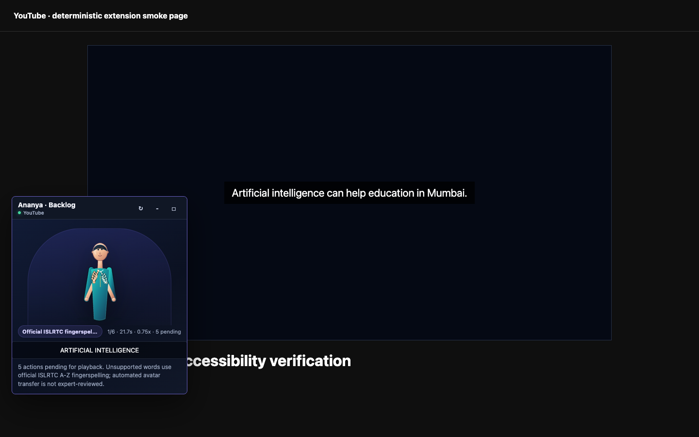
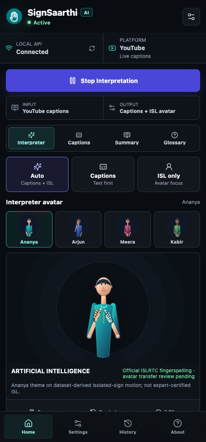
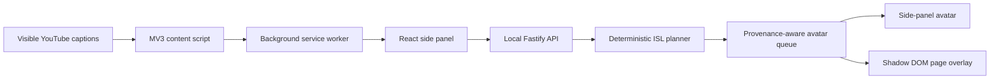

<p align="center">
  
</p>

<h1 align="center">SignSaarthi AI</h1>

<p align="center">
  <strong>Local, privacy-forward Indian Sign Language accessibility for captioned video.</strong>
</p>

<p align="center">
  SignSaarthi reads visible YouTube captions, preserves every source word, builds an
  ordered signing plan, and drives a dynamic avatar in a Chrome side panel and
  movable page overlay.
</p>

<p align="center">
  
  
  
  
  
  
</p>

<table>
  <tr>
    <td width="68%">
      
    </td>
    <td width="32%">
      
    </td>
  </tr>
  <tr>
    <td align="center"><sub>Movable Shadow DOM avatar overlay</sub></td>
    <td align="center"><sub>Chrome side panel control surface</sub></td>
  </tr>
</table>

> [!IMPORTANT]
> SignSaarthi is AI-assisted accessibility software, not a certified interpreter.
> Automated motion may be wrong. Use a qualified human interpreter for legal,
> medical, emergency, or other high-stakes communication.

Screenshots above were refreshed on September 15, 2026 using the packaged extension smoke test with deterministic caption input: a 1440×900 page and a 420×900 side panel. They demonstrate the interface and playback flow, not live-site or linguistic accuracy validation.

## Why this project exists

Most video accessibility ends at captions. SignSaarthi explores a practical next
step for Indian Sign Language users while refusing to hide the limits of current
automation. The product is built around three rules:

1. **Never drop a source word.** Each word is represented by native motion,
   ordered fingerspelling, or explicit text fallback.
2. **Never overstate evidence.** The interface distinguishes dataset-derived
   motion, official-source fingerspelling, fallback output, and expert review.
3. **Keep media private.** The MVP reads captions already visible in the page. It
   does not capture or store raw audio or video and makes no external AI calls at
   runtime.

## What works today

| Capability                           | Status         | Notes                                                                                                                      |
| ------------------------------------ | -------------- | -------------------------------------------------------------------------------------------------------------------------- |
| YouTube visible-caption ingestion    | Ready          | Polls the active caption DOM and recovers after YouTube navigation or extension reload.                                    |
| Ordered transcript-to-gloss planning | Ready          | Deterministic, source-linked, and preserves repeated words and multiword phrases.                                          |
| Dynamic avatar playback              | Ready          | 32-frame body, hand, and compact face motion with pause, resume, replay, speed, size, drag, resize, and minimize controls. |
| All-word output                      | Ready          | Uncovered Latin-script terms use dynamic ISLRTC A-Z fingerspelling; unsupported scripts stay visible as text fallback.     |
| Connection and platform status       | Ready          | Shows local API state, active platform, caption availability, and service/offline errors.                                  |
| Packaged native motion library       | Ready          | 262 source-consistent INCLUDE motions plus 26 alphabet motions.                                                            |
| Optional private research motions    | Local only     | Adds 585 gated iSign-derived word motions when the private local artifact is present.                                      |
| Caption typo matcher                 | Ready          | Fail-closed lexical matcher; it is not an ISL translator or motion generator.                                              |
| Continuous text-to-pose model        | Research only  | Dynamic geometry gate passed, but runtime use is blocked pending Deaf/ISL expert evaluation.                               |
| Meet and Zoom                        | Detection only | The UI reports the active platform honestly; caption ingestion is not claimed.                                             |
| Sign recognition and real ASR        | Not shipped    | The caption-driven MVP does not expose an unvalidated recognition model or tab-audio capture.                              |

## Architecture



The extension and API share strict Zod contracts for transcript segments,
planning actions, gloss items, motion clips, sessions, feedback, and runtime
messages. The API binds only to `127.0.0.1` and the extension communicates with
it through an explicit client header.

## Quick start

### Prerequisites

- Node.js `22.13.0` or newer
- Corepack
- Chrome or Chromium with Manifest V3 support
- macOS, Linux, or Windows for development; the checked local release artifact
  is currently built for macOS arm64

### Install and build

```bash
corepack enable
corepack install
pnpm install --frozen-lockfile
pnpm build
```

### Start the local API

```bash
pnpm --filter @signsaarthi/api start
```

The health endpoint is available at `http://127.0.0.1:8787/health`.

### Load the extension

1. Open `chrome://extensions`.
2. Enable **Developer mode**.
3. Select **Load unpacked**.
4. Choose `apps/extension/dist`.
5. Open a captioned YouTube video, select SignSaarthi, and start interpretation.

For live development, use `pnpm dev`. The extension requests only the permissions
needed for its side panel, local settings, active-tab injection, and YouTube-first
content integration.

## Runtime flow

1. The content script reads caption text that YouTube has made visible.
2. The service worker identifies the active tab and platform.
3. The side panel sends caption text, never media, to the local API.
4. The planner cleans text, splits meaning chunks, links every source token, and
   selects a native sign candidate or an explicit fallback.
5. The avatar queue resolves local motion assets, applies the selected speed, and
   plays every ordered action in the side panel or page overlay.
6. Captions, summary, glossary, history, settings, and feedback remain available
   through the side-panel tabs.

## Data and model status

| Artifact                       | Current validated state                                                                               |
| ------------------------------ | ----------------------------------------------------------------------------------------------------- |
| Runtime lexicon                | 12,434 entries, primarily indexed from ISLRTC metadata and enriched with INCLUDE provenance           |
| INCLUDE vocabulary             | 263 labels; 262 playable motions and one quarantined label conflict                                   |
| Official-source fingerspelling | 26 dynamic A-Z avatar motions                                                                         |
| Local native-motion coverage   | 843 unique labels when the optional private 585-label iSign library is available                      |
| Caption matcher                | 99,348 leakage-isolated rows; held-out F1 `0.943892`, grouped top-1 `0.993092`                        |
| Private sentence corpus        | 10,005 dynamic clips; 8,003 train, 1,002 validation, 1,000 held-out test; zero video-group overlap    |
| Text-to-pose research model    | ONNX export; 94.78% held-out hand-motion energy retained; 100% non-static outputs; runtime ineligible |

The private iSign lane uses bounded HTTP range reads to select required `.pose`
members instead of downloading the complete 228 GB dataset. iSign content,
derived private motion files, and research model weights are excluded from Git,
release archives, and project-owned Hugging Face datasets.

### Hugging Face artifacts

- [`Robin186/ISL`](https://huggingface.co/datasets/Robin186/ISL): public,
  validated metadata and vocabulary bundle.
- `Robin186/SignSaarthi-ISL-Training`: private lexical training bundle without
  gated iSign rows or pose data.

See [the ML pipeline](docs/ml-pipeline.md) and
[Hugging Face release boundary](docs/hugging-face-training.md) for exact hashes,
split rules, validators, and licensing constraints.

## Continuous integration

[](https://github.com/robinfrancis186/SignSaarthi-AI/actions/workflows/ci.yml)

Pull requests and pushes to `main` run lint, workspace and script type checks, unit/component tests, and production builds using the pinned Node and pnpm versions. Run the same lightweight checks locally:

```sh
pnpm lint
pnpm typecheck
pnpm scripts:typecheck
pnpm test
pnpm build
```

This CI does not fetch gated research data, call paid AI services, or certify interpretation accuracy. The separate manual/tag-triggered release workflow retains the heavyweight dataset/model gate.

## Verification

The main release gate intentionally runs twice:

```bash
pnpm verify
```

Each pass runs strict TypeScript checks, ESLint, unit and component tests, Python
dataset/model tests in their correct environments, production builds, dataset
validators, deterministic model generation, a packaged Chrome extension smoke
test, release packaging, and manifest/payload verification.

Use the headed real-site test after caption, routing, or avatar changes:

```bash
pnpm smoke:youtube-live
```

The current release passed two complete verification passes with 244 TypeScript
tests, six release-integrity tests, 79 general Python tests, and seven dedicated
PyTorch/ONNX tests per pass. A separate headed run passed on a real captioned
YouTube video and observed live caption updates, 12 visible word actions, and
dynamic avatar frame advancement at the default `0.75x` speed.

## API surface

| Method | Endpoint                     | Purpose                                                            |
| ------ | ---------------------------- | ------------------------------------------------------------------ |
| `GET`  | `/health`                    | Runtime, model, privacy, and local-artifact readiness              |
| `POST` | `/api/session/start`         | Start an in-memory interpretation session                          |
| `POST` | `/api/session/end`           | End a session without retaining raw media                          |
| `POST` | `/api/interpret`             | Convert caption text into planning, gloss, and avatar queue output |
| `GET`  | `/api/glossary/search?q=...` | Search the local controlled glossary                               |
| `POST` | `/api/feedback`              | Store structured local correction feedback                         |
| `POST` | `/api/privacy/purge`         | Delete local API state through explicit confirmation               |

## Repository layout

```text
apps/
  api/                 Local Fastify API and in-memory stores
  extension/           React, Vite, CRXJS Manifest V3 extension
packages/
  avatar-engine/       Motion resolution and avatar queues
  isl-engine/          Deterministic transcript-to-gloss planning
  isl-model/           Lexicon and lexical matcher contracts
  isl-video-model/     Explicitly bounded research recognition utilities
  shared/              Shared Zod schemas and TypeScript types
data/
  isl/                 Publishable metadata, checkpoints, and provenance
  models/              Validated runtime lexicon and matcher artifacts
scripts/                Dataset, training, smoke, and release tooling
docs/                   Architecture, privacy, research, and testing notes
```

## Privacy and safety

- No hidden microphone or tab-audio capture in the current release.
- No raw audio or video storage.
- No external AI requests at runtime.
- API listens on localhost only and rejects unknown extension clients.
- Private datasets, local environments, credentials, and research artifacts are
  excluded from Git and release packaging.
- Generated output always carries fallback, provenance, confidence, and review
  status so automated motion is not presented as certified ISL.

Read [the privacy model](docs/privacy.md), [architecture](docs/architecture.md),
and [testing plan](docs/testing-plan.md) before changing runtime boundaries.

## Contributing

Changes to signs or motion assets must preserve source provenance, review status,
and the all-word fallback contract. Do not mark an automated transfer as
expert-reviewed. Run focused tests while developing and `pnpm verify` before a
release-impacting change.

## Data rights and software license

Third-party datasets and dictionary sources retain their own licenses and usage
conditions. This repository does not redistribute raw ISLRTC, INCLUDE, or iSign
media. See [NOTICE](NOTICE) for attribution and the exact data-use boundary.

No project software license has been granted yet. Public repository access does
not itself grant permission to reuse the code or third-party data beyond the
rights stated by their respective owners.

## Acknowledgements

- [Indian Sign Language Research and Training Centre](https://islrtc.nic.in/)
- [INCLUDE: A Large Scale Dataset for Indian Sign Language Recognition](https://github.com/AI4Bharat/INCLUDE)
- [iSign: A Benchmark for Indian Sign Language Processing](https://aclanthology.org/2024.findings-acl.643/)

<p align="center">
  <sub>Built for transparent accessibility research, with every fallback visible.</sub>
</p>

## Contribution history

This repository contains the extension, local API, shared engines, and verification tooling. [Commit history](https://github.com/robinfrancis186/SignSaarthi-AI/commits/main/) records authorship. Dataset and motion sources retain the attribution and restrictions in [NOTICE](NOTICE); contributor identity does not imply expert linguistic validation.
