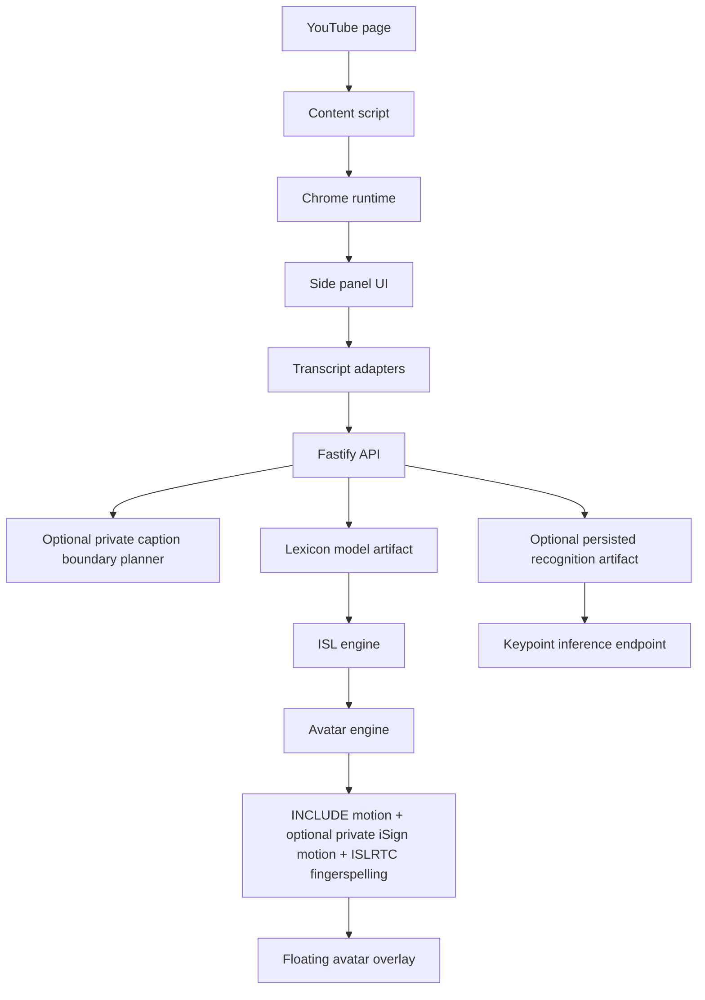

# Architecture

SignSaarthi AI starts as a Chrome Manifest V3 extension with a local backend API.

The MVP uses mock transcripts and visible YouTube captions when available. The API loads the validated 12,434-entry `data/models/isl-lexicon-model.json` artifact. Model-backed glossary entries are merged before the deterministic rule glossary, and every source word remains visible in order. A qualified optional lexical matcher may conservatively resolve a single-token caption typo while preserving the original token. An ignored local iSign caption planner may choose long-caption boundaries, but its output is accepted only when it reconstructs the exact cleaned caption. Terms without a direct motion use official ISLRTC A-Z dynamic fingerspelling when possible; unsupported scripts remain explicit caption fallbacks.

No production sign-recognition model is bundled. The API loads only persisted centroid or temporal recognition artifacts that pass schema validation; it never trains from fixtures at startup. Without such an artifact, `/api/keypoints/infer` returns `503 recognition_model_unavailable`, no ranked classes, and an explicit caption fallback. Raw video is never stored.

The side panel dispatches the API-owned `avatarQueue` to the content script so timing comes from the backend response. The content script renders a Shadow DOM overlay with movable, resizable, minimizable, pause, speed, and replay controls. Direct motions come from 262 source-consistent range-extracted INCLUDE clips and, when present only on the local machine, a bounded gated iSign research library. The API attaches only the private clips needed by the current queue; it does not expose the whole library. These motions are dataset-derived and not expert certified. One additional INCLUDE vocabulary label is quarantined from motion playback and uses visible fallback output.

Real tab audio capture, streaming ASR, hidden video capture, and automatic raw-video upload are intentionally deferred.
